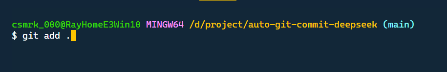
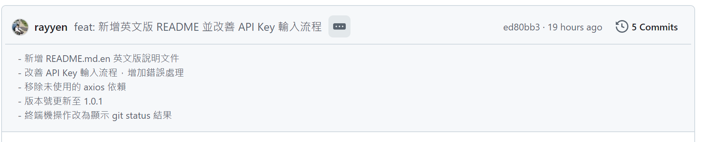

# auto-git-commit-deepseek

[English](https://github.com/rayyen/auto-git-commit-deepseek/blob/main/README.md.en "English")

a DeepSeek V3 powered VS Code extension, git 懶人專用, ctrl+shift+p 輸入 gen Commit Message 即可

## Features

利用 [DeepSeek](https://www.deepseek.com/) 自動比對修改差異，依據[Angular commit format](https://github.com/angular/angular/blob/main/CONTRIBUTING.md) 產生 git commit訊息並自動push

## Requirements

* [DeepSeek](https://www.deepseek.com/) API Key
* 新分支一定要先有分支push過 ``git push --set-upstream origin new-branch``.

---

## Usage

**git add .**



**Ctrl + Shift + p, generate commit message**


**結果範例**



## API Key Settings

Adopt SecureStore, will ask for API Key if needed.

## Extension Settings

因為diff後的訊息有很多內容可能不必要，或者是有長度問題，請參考設定，基本上預設值能滿足大多數情況

---

### 基本設定

| 配置项          | 類型     | 預設值                                            | 範例                   | 說明                                                          |
| --------------- | -------- | ------------------------------------------------- | ---------------------- | ------------------------------------------------------------- |
| url             | string   | [https://api.deepseek.com](https://api.deepseek.com) |                        | api url                                                       |
| autoPush        | boolean  | true                                              |                        | commit之後自動push                                            |
| autoAdd         | boolean  | true                                              |                        | 自動Add, add 指令參數為 rootPath/*                            |
| language        | string   | 系统语言                                          | en                     | 支持 en, zh-CN, ja 等                                         |
| model           | string   | deepseek-chat                                     |                        | 可用模型列表:deepseek-chat,目前只支持 deepseek-chat           |
| temperature     | float    | 0.7                                               |                        | 創造性(0-2)                                                   |
| maxTokens       | number   | 500                                               |                        | 生成內容最大長度                                              |
| excludeFiles    | string[] | [".png", ".jpg", ".gif", ".svg"]                  |                        | 使用通則格式排除特定文件类型                                  |
| excludePatterns | string[] | ["import"]                                        | ["^//", "console.log"] | 使用Regex片段排除包含特定模式的程式碼片段（自動添加^和$錨點） |

---

### 提問之Token長度設定 (採用推論計算長度方式，非精確計算)

| 配置项           | 類型    | 預設值 | 範例 | 說明                                   |
| ---------------- | ------- | ------ | ---- | -------------------------------------- |
| forceTruncat     | boolean | true   |      | 只有這個設定為true 以下設定才會生效    |
| maxPossibleToken | number  | 32768  |      | 參考模型版本長度對照表                 |
| chineseRatio     | float   | 0.6    |      | 0.1~0.9                                |
| englishRatio     | float   | 0.3    |      | 0.1~0.9                                |
| safetyMargin     | float   | 0.9    |      | 0.1~0.9 長度保留緩衝，避免超過長度限制 |

### 版本長度對照表

---

| 模型版本         | 最大 Tokens | 建議值 |
| ---------------- | ----------- | ------ |
| DeepSeek-7B      | 4096        | 3000   |
| DeepSeek-16K     | 16384       | 12000  |
| DeepSeek-MoE-16B | 32768       | 28000  |

### 常用排除模式示例

* `^//`：排除所有注释
* `console.*`：排除所有 console 语句
* `\bTODO\b`：排除包含 TODO 的代码
* `\d{4}-\d{2}-\d{2}`：排除日期格式

```json
{
  "deepseekCommit.autoPush": true,
  "deepseekCommit.autoAdd": true,
  "deepseekCommit.language": "zh-CN",
  "deepseekCommit.model": "deepseek-chat",
  "deepseekCommit.temperature": 0.7,
  "deepseekCommit.maxTokens": 500,
  "deepssekCommit.excludeFiles": [".png", ".jpg", ".gif", ".svg"],
  "deepssekCommit.excludePatterns": ["import"],
  "deepseekCommit.forceTruncat": true,
  "deepseekCommit.maxPossibleToken": 32768,
  "deepseekCommit.chineseRatio": 0.6,
  "deepseekCommit.englishRatio": 0.3,
  "deepseekCommit.safetyMargin": 0.9,
}
```

## Known Issues

* Fail when exceed DeepSeek token limits
* 分支一定要先有分支push過 `git push --set-upstream origin new-branch`.

## Release Notes

### 1.0.0

* Initial release of ...

### 1.0.1

* Improve API Key input workflow

### 1.0.6

* Generate different language according to vscode.env.language.

### 1.0.7

* Default ingoring changes keyword like 'import, .png, .jpg, .gif'
* Remove some illegal symbol, due to massive attack on DeepSeek server

### 1.0.8

* support settings feature

### 1.0.9

* avoid token length limit.
