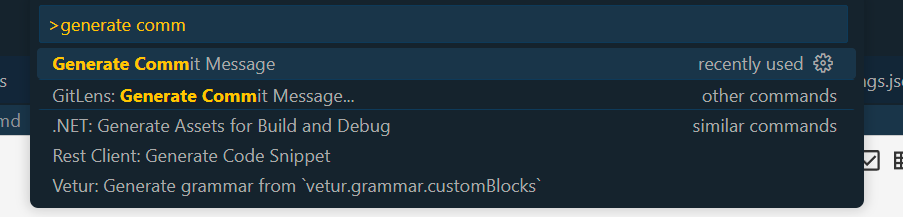

# auto-git-commit-deepseek

a DeepSeek V3 powered VS Code extension, git 懶人專用, ctrl+shift+p 輸入 gen Commit Message 即可

## Features

利用 [DeepSeek](https://www.deepseek.com/) 自動比對修改差異，依據[Angular commit format](https://github.com/angular/angular/blob/main/CONTRIBUTING.md) 產生 git commit訊息並自動push

## Requirements

* [DeepSeek](https://www.deepseek.com/) API Key
* 新分支一定要先有分支push過 ```git push --set-upstream origin new-branch```.

## Availibe Settings

---
|配置项   |類型| 預設值   |範例|說明   |
|---|---|---|---|---|
|url|string| <https://api.deepseek.com>|  |api url|
|autoPush|boolean   |true   | |提交后自动推送   |
|language |string  |系统语言 |en  |支持 en, zh-CN, ja 等   |
|model|string   |deepseek-chat|   |可用模型列表:deepseek-chat,目前只支持 deepseek-chat  |
|temperature|float| 0.7|  | 創造性(0-2)|
|maxTokens|number| 500|  | 生成內容最大長度|
|excludeFiles|string[]|[".png", ".jpg", ".gif", ".svg"]|  |使用通則格式排除特定文件类型|
|excludePatterns|string[]|["import"]|["^//", "console.log"]|使用Regex片段排除包含特定模式的程式碼片段（自動添加^和$錨點）

```json
{
  "deepseekCommit.url": "https://api.deepseek.com",
  "deepseekCommit.autoPush": true,
  "deepseekCommit.language": "zh-CN",
  "deepseekCommit.model": "deepseek-chat",
  "deepseekCommit.temperature": 0.7,
  "deepseekCommit.maxTokens": 500,
  "deepssekCommit.excludeFiles": [".png", ".jpg", ".gif", ".svg"],
  "deepssekCommit.excludePatterns": ["import"]
}
```

---

### 常用排除模式示例

* `^//`：排除所有注释
* `console.*`：排除所有 console 语句
* `\bTODO\b`：排除包含 TODO 的代码
* `\d{4}-\d{2}-\d{2}`：排除日期格式

### How

**git add .**


**Ctrl + Shift + p, generate commit message**


**結果範例**


## Extension Settings

Adopt SecureStore, will ask for API Key if needed.

## Known Issues

* Fail when exceed DeepSeek token limits

## Release Notes

### 1.0.0

Initial release of ...

### 1.0.1

Improve API Key input workflow

### 1.0.6

Generate different language according to vscode.env.language.

### 1.0.7

* Default ingoring changes keyword like 'import, .png, .jpg, .gif'

* Remove some illegal symbol, due to massive attack on DeepSeek server

### 1.0.8

* support settings feature
